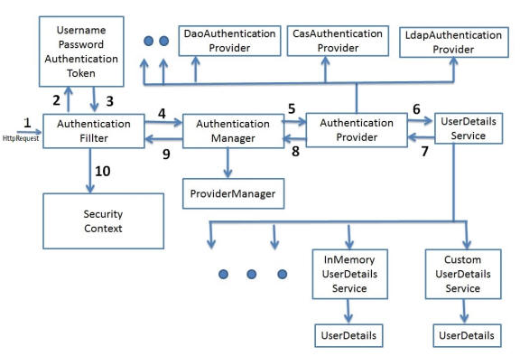

# Spring Security Architecture

## process step

* request comes in with credential 
    * credential can be user name and password combinations, tickets, or public key cert.
* **Authentication Filter** transfer credential to **Authentication Manager**
* **Authentication Manager** transfer credential to **Authentication Provider**
* **Authentication Provider** ask the actual **User detail service** to authenticate the request
* finally put the **Authentication Token** into Security Context

